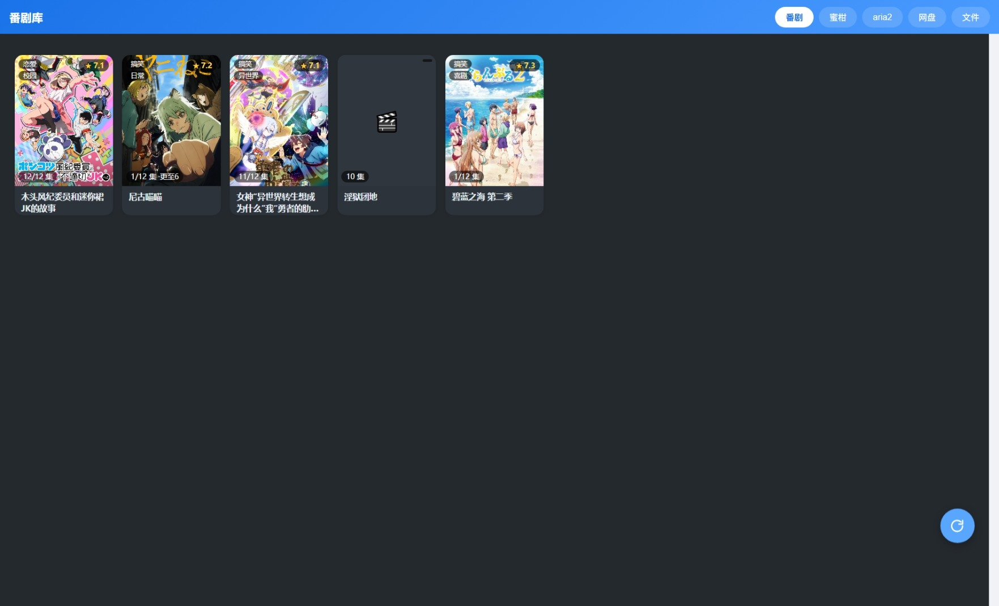
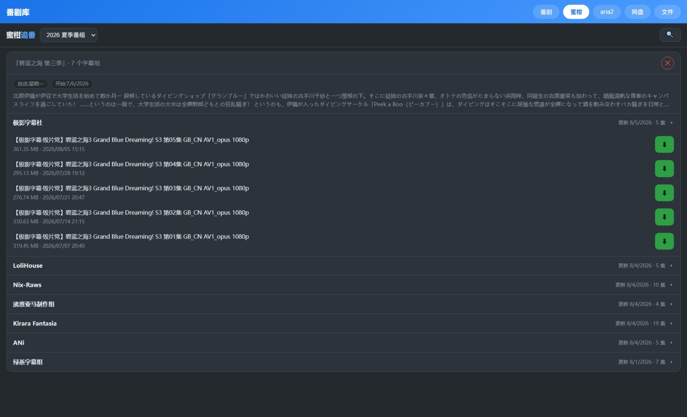
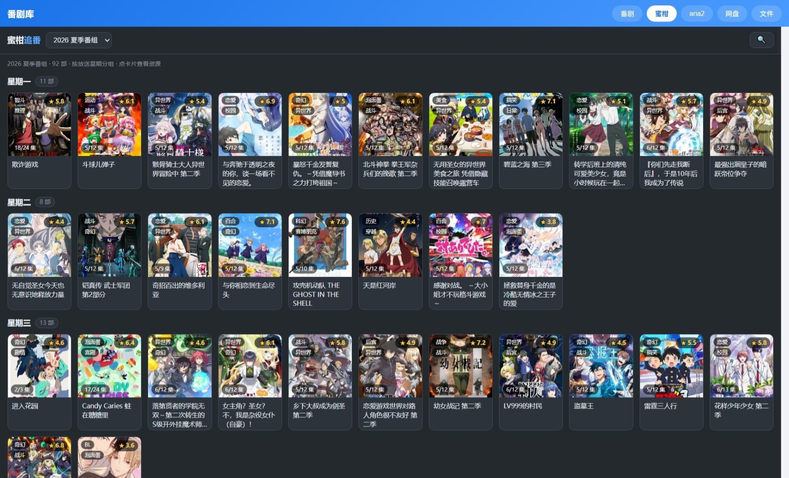

# 路由器 Kwrt 项目文件归档(2026-08-06)

家庭路由器(Kwrt/OpenWrt,MT7981 等)的番剧库项目:自写网页、nginx 反代配置、LuCI 控制面板,打包为 OpenWrt ipk 发布。
部署目标:路由器 `/www/`(网页)、`/etc/nginx/conf.d/`(反代)、`/etc/...`(服务配置)。

## 界面预览


## 目录结构

```
router-kwrt/
├── www/                     → /www/
│   ├── anime.html           番剧库(原 videos.html,旧名已 301)
│   ├── hub.html             导航首页(hub)
│   ├── mikan/index.html     蜜柑追番页(含评分角标)
│   ├── index.html           旧版(历史)
│   ├── bg2/detail/detail2/dow.html  早期版本(历史,可删)
├── nginx/                   → /etc/nginx/conf.d/
│   ├── anime-redirect.locations?   (anime.html 旧链接 301,在路由器上:anime-redirect.locations)
│   ├── aria2.locations      aria2 RPC 反代
│   ├── bgm.locations        BGM API 反代 + 12h 缓存
│   ├── cleanup.locations / list.locations / prune.locations / rescan.locations / video-del.locations
│   ├── fb.locations         FileBrowser 反代(/fb/,Host $host 必须!)
│   ├── html-nocache.locations
│   ├── hub-cache.locations
│   ├── luci.locations / media.locations
│   ├── mikan-cache.conf     proxy_cache_path(mikan_img zone)
│   ├── mikan-img.locations  蜜柑封面图缓存
│   ├── mikan-proxy.locations 蜜柑数据反代 + 分级缓存(12h/1h/5m/torrent不缓存)
│   ├── pan.locations        百度网盘反代(/pan/)
│   ├── webdav.conf.sample   (GoWebDAV 已停用,留样)
│   ├── dandan.locations     废弃(弹弹play 方案已放弃)
│   └── hub-cache.locations.bak
├── cgi/                     → /www/cgi-bin/(删除/清理/列表/重扫)
│   ├── cleanup.cgi          清理 aria2 残留 + 重扫
│   ├── list.cgi             目录列表(文件夹视图已删,可能不再用)
│   ├── prune.cgi            删除空目录
│   └── rescan.cgi           触发 videos.json 重扫
├── services/
│   ├── filebrowser/config.yaml  FileBrowser Quantum 1.5 配置(源文件!baseURL=/fb/)
│   ├── fb-min.yaml          (同 config.yaml,别名)
│   ├── ksmbd.conf           SMB 配置(interfaces = br-lan tun0,自定义文件非 uci)
│   ├── easytier-config.toml EasyTier 组网
│   └── fbcheck.sh / fb-tiny.yaml  调试脚本
└── windows/                 Windows 本机脚本
    ├── mount-smb.bat        开机挂载 SMB Z:(当前在用)
    └── mount-webdav.bat     旧 WebDAV 版本(历史)
```

## 关键注意事项(坑)

- **anime.html 改动后同步到 /www/anime.html**;旧链接 /videos.html 有 nginx 301
- **FileBrowser**:nginx 反代必须 `proxy_set_header Host $host`(否则 cookie Domain=127.0.0.1,浏览器登录后全 401);配置源文件 services/filebrowser/config.yaml;**fb 静态资源 `/fb/public/static/assets/` 已配 immutable 长缓存(带 hash,省 4.6MB JS 重下),`proxy_hide_header Cache-Control` 清上游头**
- **蜜柑分级缓存**:正则 location 的 proxy_pass 用捕获组 $1 剥前缀;proxy_ignore_headers 强制缓存 no-store 响应
- **mikan/anime 元数据**:蜜柑详情页带 `bgm.tv/subject/{id}` 链接 → bgm v0 接口(`/bgm/v0/subjects/{id}` 评分/total_episodes/tags + `/bgm/v0/episodes?subject_id=` 已更新集数 = **airdate≤今天的条数**,不是 total!);localStorage 7 天 + nginx 12h
- **tag 白名单 GENRES**:anime/mikan 都用同一份题材白名单(120+ 词,中文+英文),过滤人名/厂商/日期/梗;两页各自维护 `const GENRES`
- **主题**:anime/mikan 均为 FileBrowser 同款深色(GitHub Dark):bg #24292e / card #2d333b / line #444c56 / tx #e6edf3 / mut #8b949e / acc #58a6ff;卡片角标:左上 tags(垂直)/右上 ⭐评分/左下 集数进度
- **videos.json 与 /media/ 视频**:nginx 已加 `Cache-Control: no-cache`(配合 ETag 304;视频避免浏览器长期缓存)
- **ksmbd**:/etc/ksmbd/ksmbd.conf 是自定义文件(非符号链接),uci 被忽略,直接改文件

## 数据源备注(bgm-sample/)

`router-kwrt/bgm-sample/{622206,899,530158}.json` 为 BGM v0 subject 原始响应样例(19 个顶层字段:date/platform/images/summary/name/name_cn/tags/infobox/rating/total_episodes/collection/id/eps/meta_tags/volumes/series/locked/nsfw/type)。

## 打包交付(ipk)

**产出**:`kwrt-mediahub_1.0.0-1_all.ipk`(根目录,25KB)——OpenWrt 插件包,内容 = www 3 页 + nginx conf.d 配置(不含 fb/pan,按需部署)+ cgi 5 个 + video_scan.sh,postinst 自动 nginx reload + 装 crontab(整点重扫)。

**构建**(本机,无需 ar 工具):
```sh
node build-ipk.js   # 读取 pkg/control.tar.gz + pkg/data.tar.gz,手写 ar 归档生成 ipk
node verify-ipk.js  # 校验 ar 结构并提取成员(提取到 pkg/_* 供 tar 核对)
```

**安装**(路由器):
```sh
scp kwrt-mediahub_1.0.0-1_all.ipk root@<路由器IP>:/tmp/
opkg install /tmp/kwrt-mediahub_1.0.0-1_all.ipk
```

**卸载**:
```sh
opkg remove kwrt-mediahub
```

**注意**:
- 定位是**同环境快照/恢复包**:nginx locations 硬编码本机反代目标(127.0.0.1:8989/6800/10780、mikanani.me)、hub 内含 admin 默认密码、依赖 OpenClash/FileBrowser/百度网盘等外部服务——装到新路由器前需按环境调整
- **不打包 fb.locations/pan.locations**(FileBrowser/百度网盘非本包依赖):用户未安装对应服务时,hub 的「文件/网盘」tab 由 hideDeadTabs 自动隐藏(探测 502);需要时从归档手动部署这两个配置
- 不打包 nginx TLS 证书(_lan.crt/_lan.key 机器特定)
- 安装会覆盖 /www/anime.html、hub.html、mikan/index.html 及 conf.d 同名配置并 reload nginx

## luci-app-mediahub(控制页面)

**产出**:`luci-app-mediahub_1.0.0-1_all.ipk`(5.6KB)——LuCI 应用,菜单「服务 → 媒体中心」。

**功能**:
- 服务主开关(enabled)+ 下载目录(dir)+ 媒体根(root),表单保存到 `/etc/config/mediahub`
- 「立即应用」:apply.sh 把 dir/root 全局同步到 aria2 uci(重启 aria2)、video_scan.sh、nginx media.locations(reload)、cgi BASE
- 「预览应用」:apply.sh --dry-run(不修改)
- 「读取 aria2 配置」:读当前 `uci aria2 dir`
- 「立即重扫」/「清蜜柑缓存」/「连通性测试」/「nginx 日志」:调 /mediahub-api(nginx → uhttpd cgi-bin)

**结构**:
```
luci-app-mediahub/
├── etc/config/mediahub                 uci 配置(唯一真相源:enabled/dir/root)
├── etc/nginx/conf.d/mediahub.locations /mediahub-api 反代
├── usr/libexec/mediahub/apply.sh       目录全局应用(dry-run 支持)
├── usr/libexec/mediahub/clear-cache.sh 清蜜柑缓存
├── www/cgi-bin/mediahub-api            后端 API(必须输出 Content-Type 头!uhttpd 要求)
├── usr/share/luci/menu.d/luci-app-mediahub.json
├── usr/share/rpcd/acl.d/luci-app-mediahub.json
└── www/luci-static/resources/view/mediahub/main.js
```

**坑**:uhttpd cgi 必须 `echo "Content-Type: application/json"` + 空行,否则 502 "did not produce any response";apply.sh 的 sed 用 `|` 分隔符(路径含 /),顺序先替换根再替换 Aria2 特例。

## 安装前置条件(出厂 OpenWrt 路由器)

装 ipk 前,基于全新 OpenWrt/Kwrt 固件需要准备:

### 1. 软件依赖(ipk 不包含,需先装)
```sh
opkg update
opkg install aria2 luci-app-aria2    # 下载引擎(必需)
# nginx / luci-base 固件一般自带;如缺失:opkg install nginx luci-base
```
- 可选:`filebrowser`、百度网盘(不装则 hub 的「文件/网盘」tab 自动隐藏)
- 可选:OpenClash 等代理(访问蜜柑/bgm 更稳定;无代理也可直连)

### 2. 存储准备
1. 挂载存储分区(U 盘/eMMC),例如 `/mnt/mmcblk0p7`(路径可自定,装完用 LuCI 页面改)
2. 创建下载目录并设置 aria2 属主:
   ```sh
   mkdir -p /mnt/mmcblk0p7/Aria2
   chown aria2:aria2 /mnt/mmcblk0p7/Aria2
   ```
   (install.sh 会自动做第 2 步;手动装 ipk 时需自己做)

### 3. 安装顺序
```sh
opkg install kwrt-mediahub_1.0.0-1_all.ipk
opkg install luci-app-mediahub_1.0.0-1_all.ipk
```
(推荐直接用 `install.sh` 一键完成:装依赖 + 检测存储 + 建目录 chown + 装包)

### 4. 装完配置(LuCI → 服务 → 番剧库)
- 确认「aria2 下载目录」「媒体根目录」→ 点「立即应用」
- 填「FileBrowser 密码」(可选,填了 hub 文件 tab 免登录)

### 5. 网络说明
- bgm/封面反代内置 `resolver 114.114.114.114` 直连公网 DNS,**不依赖代理**
- 蜜柑反代走系统 DNS,**无代理可用但可能慢**,OpenClash 环境更稳
- 蜜柑反爬:浏览器访问正常;curl 等无浏览器头的请求可能被降级(属蜜柑正常反爬,非故障)

## 截图






## 发布包(给小白)

发布目录含 4 个文件(两个 ipk + 两个脚本),上传到路由器后执行:

```sh
# 上传(任选其一)
scp kwrt-mediahub_1.0.0-1_all.ipk luci-app-mediahub_1.0.0-1_all.ipk install.sh uninstall.sh root@<路由器IP>:/tmp/

# 安装(自动装依赖 aria2/nginx、检测存储、建目录 chown、装 ipk、写默认路径)
sh /tmp/install.sh                              # 自动检测存储
sh /tmp/install.sh /mnt/sda1/Aria2 /mnt/sda1   # 或手动指定下载目录/媒体根

# 卸载(保留视频数据,自动清 cron/8080 uhttpd/rc.local/缓存)
sh /tmp/uninstall.sh
```

**install.sh 自动完成**:opkg 装依赖 → 检测存储分区 → 建目录 + chown aria2 → 装两个 ipk → 写默认路径到 uci。装完打开 **LuCI → 服务 → 番剧库** 确认并点「立即应用」。

## 常用命令

```sh
# 部署单个文件
pscp -batch 文件 root@<路由器IP>:/目标路径

# nginx 配置检查
plink -ssh root@<路由器IP> "nginx -t -c /etc/nginx/uci.conf"
```
