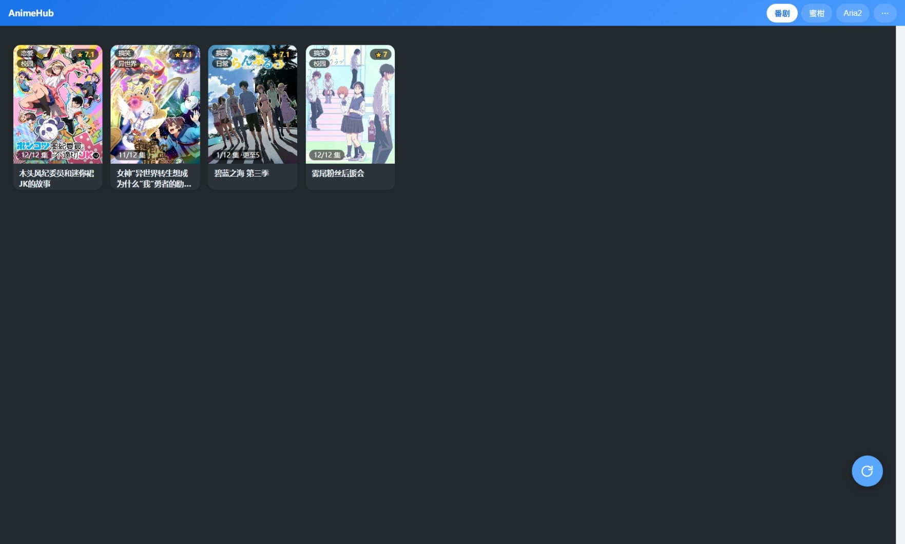
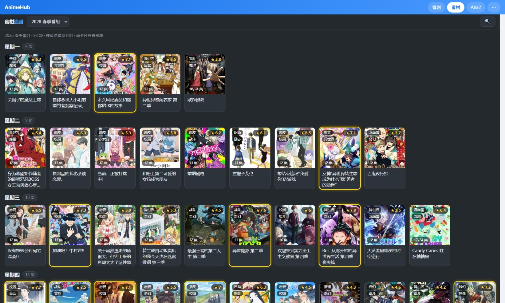
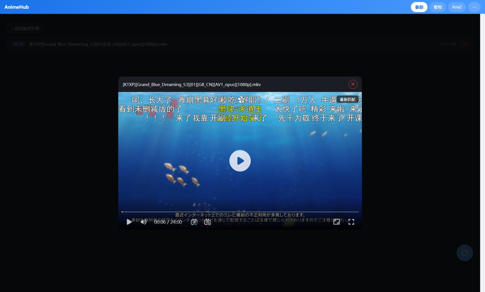
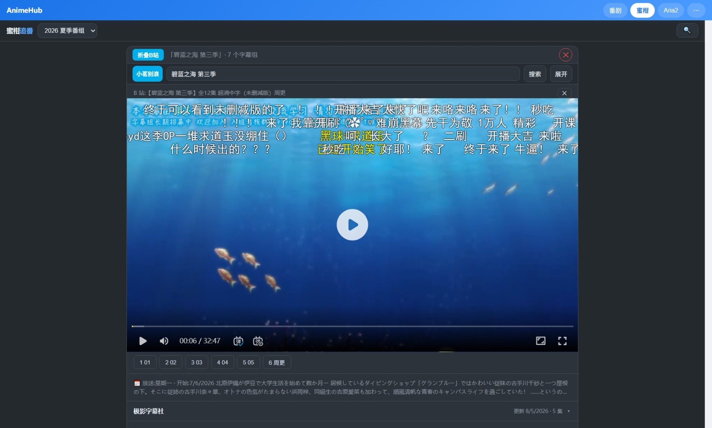
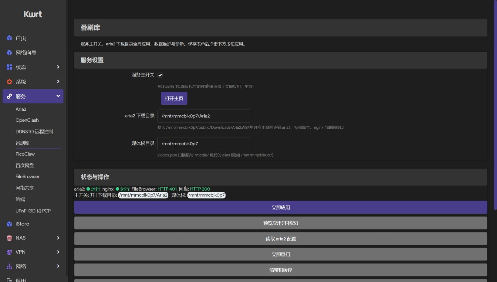

# AnimeHub

> 跑在路由器上的番剧库 · 追番 · 弹幕一体化方案

家庭路由器(Kwrt/OpenWrt,MT7981)上的自建番剧中心:**蜜柑追番** 与 **本地番剧库** 双视图 + **B 站内嵌播放器**(弹幕/扫码登录/720P 流畅播放)+ **LuCI 控制面板**,全部由自写网页 + nginx 反代 + shell CGI 组成,可打包为 OpenWrt ipk 一键部署。

## 界面预览











## 功能特性

### 🏠 一站式导航(hub)
- 单页聚合 **番剧库 / 蜜柑 / Aria2 / 网盘 / 文件** 五个 tab,iframe 懒加载
- 网盘、文件默认折叠,「⋯」一键展开;切换 tab 自动暂停原页面视频

### 🍙 蜜柑追番(mikan)
- **季度番组**:按星期分组的海报墙,季度选择记忆上次选中(追更自动跟随新季、考古保持旧季)
- **番剧搜索** + **详情页**:按字幕组归档,每集一键 aria2 下载(自动带下载映射索引)
- **B 站自动匹配**:播放即匹配 B 站资源(智能评分选合集、季数修正防串季、复用 mikan 缓存不重复搜索)

### 🎬 番剧库(anime)
- **本地视频海报墙**:bgm 刮削封面 / 评分 / 题材 tag / 集数进度(本地集数 + 已更新集数)
- **内嵌播放**:本地视频 + 外挂字幕(mp4/AVC 浏览器直播;mkv/HEVC 受浏览器解码能力限制)
- **B 站弹幕**:自动匹配集数、手动重新匹配、弹幕开关/样式调节、mikan 下载映射直接复用
- 两段式删除(连 .aria2 断点文件)

### ▶️ B 站播放器
- 内嵌 ArtPlayer:扫码登录、弹幕(滚动/顶部/底部)、全屏自动横屏(Android)、**720P 流畅播放**(单文件流,兼顾路由器转发性能;新番 720P 足够)
- 弹幕显示区域 1/4 ~ 满屏可选

### 🎛 LuCI 控制面板
- **服务主开关**:OpenClash 式即点即生效(停用页面反代 + 定时重扫)
- **Aria2 下载目录** 全局应用(同步 aria2 / 扫描脚本 / nginx / 删除接口)
- **存储分区目录**、**FileBrowser 密码**
- **B 站登录管理**(状态显示 + 一键清除)
- 立即重扫 / 清蜜柑缓存 / 连通性测试 / nginx 日志

## 快速开始

### 一键安装(推荐)
发布目录含 4 个文件(两个 ipk + install/uninstall 脚本),上传到路由器后:

```sh
scp kwrt-mediahub_*.ipk luci-app-mediahub_*.ipk install.sh uninstall.sh root@<路由器IP>:/tmp/

sh /tmp/install.sh                              # 自动检测存储分区并安装
sh /tmp/install.sh /mnt/sda1/Aria2 /mnt/sda1   # 或手动指定 下载目录/存储分区
```

`install.sh` 自动完成:装依赖(aria2 等)→ 检测存储 → 建目录 + 设 aria2 属主 → 装两个 ipk → 写默认路径。

装完打开 **LuCI → 服务 → AnimeHub**,确认目录并应用。

### 手动安装
```sh
opkg install kwrt-mediahub_*.ipk
opkg install luci-app-mediahub_*.ipk
```

### 前置条件
- OpenWrt/Kwrt 固件(nginx、luci-base 一般自带)
- 一块存储分区(挂载如 `/mnt/mmcblk0p7`),媒体存放其下 `Aria2/` 目录
- 可选:FileBrowser、百度网盘(不装则 hub 对应 tab 自动隐藏)、OpenClash(蜜柑访问更稳)

## 项目结构

```
├── www/                  → 路由器 /www/(网页)
│   ├── hub.html            导航首页
│   ├── anime.html          番剧库(本地视频 + 弹幕)
│   ├── mikan/index.html    蜜柑追番页
│   └── lib/                公共 JS(player-common / artplayer / qrcode)
├── nginx/                → /etc/nginx/conf.d/(反代配置)
│   ├── mikan-proxy.locations   蜜柑数据反代 + 分级缓存
│   ├── bgm.locations           BGM API 反代(评分/元数据)
│   ├── bili*.locations         B 站 API / 视频流反代
│   ├── media.locations         本地视频播放
│   ├── aria2/fb/pan/luci…      各服务反代
├── cgi/                  → /www/cgi-bin/(shell 后端)
│   ├── bili.cgi              B 站代理(搜索/弹幕/流/扫码登录)
│   ├── mediahub-api          LuCI 控制页 API
│   └── del/cleanup/rescan/prune/list
├── luci-app-mediahub/     LuCI 应用打包源
│   └── www/luci-static/…/mediahub/main.js  控制面板视图
├── screenshots/           README 展示截图
└── build-ipk.js / install.sh / uninstall.sh
```

## 技术要点

- **纯静态单文件网页 + nginx 反代 + shell CGI**:无后端框架,零依赖自托管
- **蜜柑分级缓存**:星期页 12h / 详情 1h / 搜索 5m / 封面 30d(nignx 磁盘缓存)
- **bgm 元数据刮削**:蜜柑详情页提取 bgm id → v0 API,localStorage + nginx 双层缓存
- **B 站链路**:wbi 签名、登录令牌持久化(重启保留)、二维码扫码登录、弹幕 XML、`/bili-stream2` 流式反代(支持 Range 拖动)
- **智能弹幕匹配**:文件名解析(季数/集数)→ bgm 中文名修正 → B 站搜索候选评分(合集优先)→ mikan 下载映射/b站匹配缓存复用
- **LuCI 应用**:JS view + uhttpd cgi API,主开关即点即生效

## 常见问题

| 问题 | 说明 |
|---|---|
| B 站播放 720P? | 当前统一 720P(单文件流方案,兼顾路由器转发性能;新番 720P 足够) |
| mkv/HEVC 播不了? | 浏览器无对应解码器,网页内无法播放;安装指南:https://www.bilibili.com/video/BV1bf4y1A7co |
| 蜜柑页面空白? | 蜜柑对无浏览器特征的请求(如 curl)会降级,浏览器访问正常 |
| 换存储盘? | LuCI 控制页改「存储分区目录」+「Aria2 下载目录」→ 应用 |

## License

MIT
